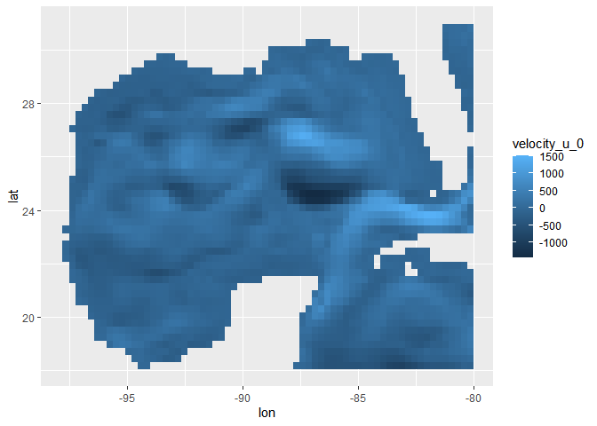
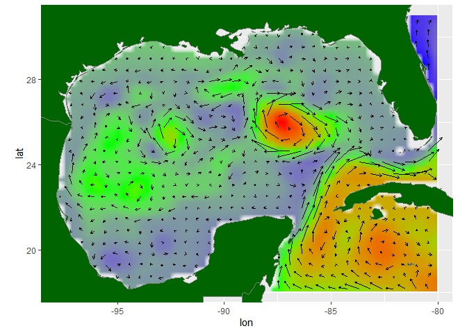

<!-- README.md is generated from README.Rmd. Please edit that file -->

# RGEEtools

<!-- badges: start -->
<!-- badges: end -->

The goal of RGEEtools is to create easy harvesting of gee data and
convert it to formats compatible with other r packages (like ggplot2).
The focus data source for these function is the hycom numerical model
but other sources (such as MODIS) are an object for future versions.

## Installation

You can install the development version of RGEEtools from
[GitHub](https://github.com/) with:

``` r
# install.packages("devtools")
devtools::install_github("JaceInnis/RGEEtools")
```

## Example

This is a basic example which shows you how to extract hycom data into a
tidy datafram:

``` r
#rgee should be already initialized 

# creates the gee geometry object necessary for any spacial query, The format of the string is copied and pasted from the gee gui. 
ROI = ROI("[-99, 31], [-99, 18], [-80, 18], [-80, 31]")

# obtains a 5 day average, the forward interval being 2001-09-28 at a resolution of 30,000 meters within the region of interest. 
list = wvtolist(ROI = ROI, date = "20180805", interval = 5, scale = 30000, depth = 0)

#converts the ree list to a r dataframe
df = geetodf(list)

head(df)
#>         lon      lat velocity_u_0 velocity_v_0
#> 1 -94.45785 18.19088        -23.4        -22.2
#> 2 -94.18836 18.19088        -21.8        -33.8
#> 3 -87.72049 18.19088          3.2        333.0
#> 4 -87.45099 18.19088        -36.4        453.4
#> 5 -87.18150 18.19088       -107.8        300.6
#> 6 -86.91200 18.19088       -332.0        424.2
```

Now that we have a tidy data frame, we can visualize our data using some
typical ggplot operations.

``` r
# plots the results in a raster from ggplot
ggplot(df, aes(lon, lat)) +
  geom_raster(aes( fill = velocity_u_0))
```



We can utilize some other functions in the package as well as some
tidyverse functions to make more complicated plots

``` r

tis = ssetolist(ROI = ROI, date = "20180805", interval = 5, scale = 30000)

df2 = geetodf(tis)

df = inner_join(df, df2)
#> Joining, by = c("lon", "lat")


awr = thin(df, 2) # A function that would limit the number of drawn arrows by 2


ggplot(df, aes(lon, lat)) +
  geom_raster(aes( fill = surface_elevation), interpolate=TRUE)+
  geom_segment(aes(x = lon,y =  lat, xend = lon + velocity_u_0/1200, yend = lat + velocity_v_0/1200),
              size = 0.4 , arrow = arrow(length = unit(0.1,"cm")), 
              data = df[awr,] )+
  scale_fill_gradientn(colours=c("blue","green","red"))+
  borders("world", 
          xlim = c(min(df$lon), max(df$lon)), 
          ylim = c(min(df$lat), max(df$lat)),
          fill = "dark green") +
  coord_fixed(xlim = c(min(df$lon), max(df$lon)),
              ylim = c(min(df$lat), max(df$lat)))+
  theme(legend.position="none")
```


